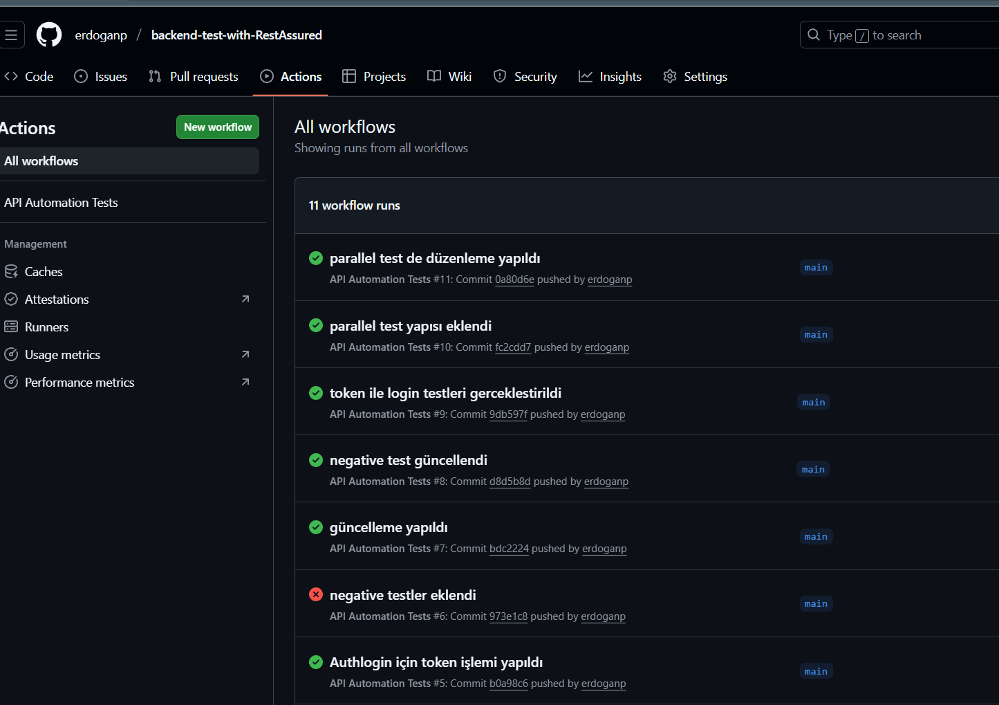
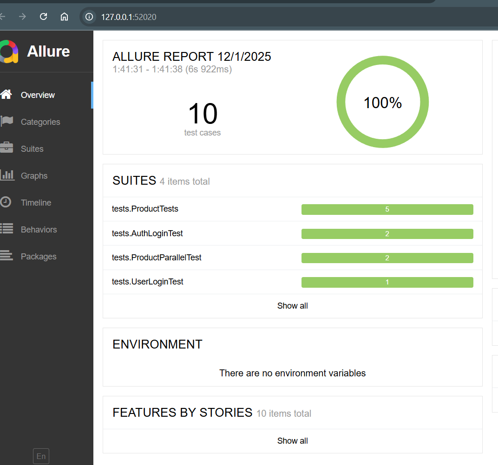

# Backend Test with RestAssured   

---

## Project Overview

This project is a **backend API automation test suite** using **Java, Maven, Rest-Assured, and JUnit 5**.  

It validates REST APIs for both **positive** and **negative scenarios**, including **CRUD operations, schema validation**, and **error handling**.  

---

## Technologies Used

- **Java 17**  
- **Maven 3**  
- **Rest-Assured 5.4.0**  
- **JUnit 5**  
- **JSON Schema Validation**  
- **Allure Reporting**  
- **Git / GitHub**  
- **CI/CD**: GitHub Actions

---

## Project Structure
backend-test-with-RestAssured/
├─ pom.xml
├─ src/test/java/
| ├─ base/ # BaseTest class
│ ├─ models/ # Request & Response POJO classes
│ ├─ tests/ # Positive, negative, edge case tests
│ └─ clients/ # general Methods
├─ src/test/resources/
│ └─ schemas/ # JSON Schema files
└─ .github/workflows/ # GitHub Actions CI pipeline

---

## Test Scenarios

### Positive Tests
- Get product by valid ID → Validate status code, response fields
- Create, Update, Delete product → Validate request & response
- Schema validation for response contract

### Negative Tests
- Get product with invalid/non-existing ID → Expect 404
- Create product with missing/invalid fields → Expect 400
- Delete product with invalid ID → Validate proper error response

### Assertions & Validation
- Field-level checks: `id`, `title`, `price`, `description`, `category`  
- JSON Schema validation for response structure  
- HTTP status code validation (200, 404, 400, etc.)  

---

### Running Test Locally

1. Clone the repository
 git clone https://github.com/erdoganp/backend-test-with-RestAssured.git
cd backend-test-with-RestAssured

2.Run test using Maven
mvn clean test
---

### CI/CD 

## Github Action Workflow

* Automatically runs tests on push / pull requests

* Generates JUnit reports

name: Maven Test

on: [push, pull_request]

jobs:
  build:
    runs-on: ubuntu-latest
    steps:
      - uses: actions/checkout@v3
      - name: Set up JDK 17
        uses: actions/setup-java@v3
        with:
          java-version: '17'
      - name: Run Maven tests
        run: mvn clean test
      - name: Publish Allure Report
        run: |
          mvn allure:serve

## Allure Report

## Dockerize

### Author
## Erdoğan Paçacı – Backend Test Automation Enthusiast

